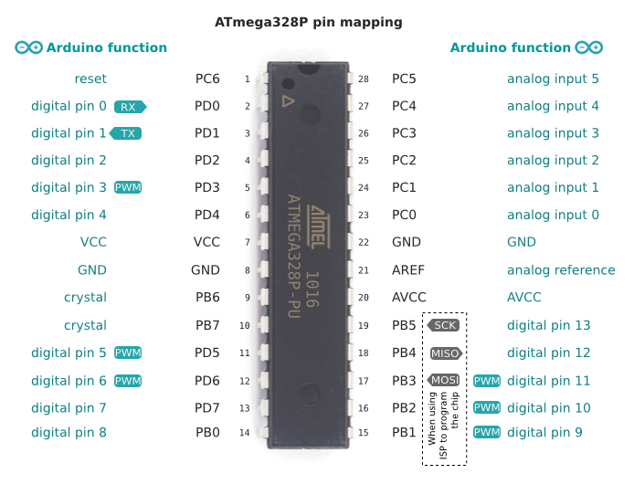

## Test Board

#### [GENIUS KIT STARTER PACK](http://kocoafab.cc/product/genius)
#### ATmega328P pin mapping

#### [Arduino Schematic](https://www.arduino.cc/en/uploads/Main/ArduinoNano30Schematic.pdf)
#### Arduino Bootloader
Arduino/hardware/arduino/avr/bootloaders/optiboot from [Arduino](https://github.com/arduino-org/Arduino)
#### [Fuse settings](http://www.martyncurrey.com/arduino-atmega-328p-fuse-settings/)
#### [Lock bits](http://www.avrfreaks.net/forum/lock-bits-1)
#### [Fuse calculator](http://eleccelerator.com/fusecalc/fusecalc.php?chip=atmega328p)
#### [Bootloader setting with avrdude](http://www.hackersworkbench.com/intro-to-bootloaders-for-avr)

## Prerequisite

#### [AVR-Common](https://github.com/hokim72/AVR-Common)

## Compile and build

```
$ cd ~/work/avr
$ git clone https://github.com/hokim72/AVR-Programming.git
$ mkdir AVR-Programming/project_dir/build; cd AVR-Programming/project_dir/build
$ cmake-avr ..
$ make flash
```

## AVR USB Bootloader

#### [AVR Bootloader](http://www.electroschematics.com/10778/avr-bootloader/)
#### [Working With Bootloaders & Build Your Own Bootloader – 1](http://www.electroschematics.com/10850/working-bootloaders-build-bootloader-1/)
#### [Working With Bootloaders & Build Your Own Bootloader – 2](http://www.electroschematics.com/10922/working-bootloaders-build-bootloader-2/)

## AVR Definitions and Functions

#### [busy-wait delay loops](http://www.nongnu.org/avr-libc/user-manual/group__util__delay.html)
